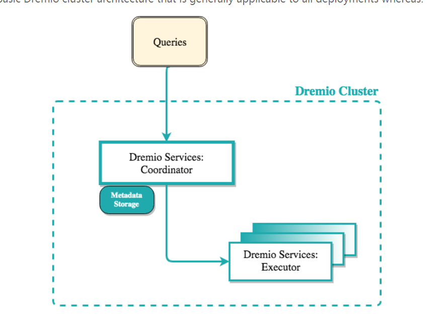

# dremio

知识储备:

数据湖    
运维    

## 数据湖: 
- 价值:    
数据湖的一部分价值是把不同种类的数据汇聚到一起;
另一部分价值是不需要预定义的模型就能进行数据分析。可提供更便捷高效的实时分析能力    
现在的大数据架构是可扩展的，并且可以为用户提供越来越多的实时分析.

- 问题

数据湖架构面向多数据源的信息存储，包括物联网在内.
1 数据湖的数据持久性.要求数据长期存储,这需要保证数据具有长期时效价值以抵消容量成本    
2 安全却是需要优先考虑的因素.将所有鸡蛋放到一个篮子里,如何保证每个数据源都安全可靠.

## 使用

### 下载

安装包下载地址: https://download.dremio.com/

安装依赖
- 4.0后不支持mac和windows.linux版本:     
RHEL and CentOS 6.7+, 7.3+, and 8.3 (RPM and tarball)     
SLES 12 SP2+ (tarball)     
Ubuntu 14.04+ (tarball)     
Debian 7+ (tarball)     

- jdk1.8    
-  Dremio UI要求浏览器版本:    
> Google Chrome 54+
Apple Safari 11+
Mozilla Firefox 50+
Microsoft Edge 14+

## 集群部署

dremio在设计上支持1000+个节点分布运行.也支持单节点本地运行.    
dremio也是一个可以部署在公有云和私有服务的分布式系统.dremio集群可以和数据源部署在一起也可以分离部署.

### 部署架构

集群部署架构:    

查询(Queries): dremio REST/UI或Dremio OJBC/JDBC的发出        
协调者节点(Coordinator node): 主协调者(master-coordinator)角色可以有多个.但dremio集群推荐只有一个协调者节点    
执行者节点(Executor nodes): 可以配置多个执行者(executor)角色.实际数量看你的负载.如:当你有大数据量查询或者大量查询请求时可以增加执行器节点数    
元数据存储(Metadata storage): 一般存储在协调者节点本地.默认: 不要求配置.如果配置了高可用,元数据存储必须作为外部存储配置.    
Zookeeper: 可以嵌入在协调者节点也可以使用外部服务.默认:嵌入.如果配置了高可用,必须配置外部服务.    
分布式存储(Distributed Store): 本地安装并在所欲dremio节点配置.    

#### dremio services

Dremio "services"参数用于指定一个节点是否是主协调者,副协调者或执行者角色.    

dremio集群组成:    
> 一个或多个协调者节点
> 一个或多个执行器节点

- 主协调者角色(Master Coordinator Role)

主协调者角色用于专门管理元数据.其他职责:    
查询计划    
提供UI服务    
处理客户端连接,包括rest API

高可用实现中可以设置多个协调者节点.如果协调者节点故障,则其他节点将作为备用节点.    

- 副协调者角色(Secondary Coordinator Role)

副协调者节点用于增加并发和分配ODBC and JDBC客户端请求的查询计划到执行节点

- 执行者角色(Executor Role)

执行者节点用于执行查询

- 单节点和集群部署

单节点部署: 执行和协调都在一个节点中.单节点多角色    
集群部署: 每个节点一个角色,协调者或执行者.集群部署不支持单节点多角色.    

#### 元数据存储

dremio存储的元数据包括用户,空间,和数据集(users, spaces, and datasets).默认,这些元数据存在"${DREMIO_HOME}/data"目录.    
管理员可以在dremio.conf配置paths.local自定义元数据存储地址.    

- I/O性能

Dremio元数据服务于两种工作负载类型:    
| 工作负载类型 | 性能影响因素 |
| ---- | ---- |
| 用户查询请求和数据反射刷新 | 性能受查询并发数影响 |
| Dremio收集和记录源数据集(source datasets)信息的元数据刷新 | 性能受dremio连接的物理数据集数量和刷新频率影响.为满足查询工作负载和元数据刷新策略可能要去更大的吞吐量 |

- 用户查询请求和数据反射刷新

用户查询请求和数据反射刷新的性能要求与每秒并发查询数成线性相关

| 查询/秒 | 吞吐量 |
| ---- |---- |
| 50 | 60MB/s |
| 100 | 120MB/s |
| 200 | 240MB/s |

- 元数据刷新

元数据刷新的性能要求与数据集数量和每个数据集的列平均数和拆分数成线性比例.性能要求与刷新间隔成反比.

| 数据集数 | 数据集列平均值,拆分数 | 吞吐量 | 
| 1000 | 每数据集20列,1000片,刷新间隔30分钟 | 1MB/s |
| 2000 | 每数据集20列,1000片,刷新间隔30分钟 | 2MB/s |
| 2000 | 每数据集20列,1000片,刷新间隔10分钟 | 3MB/s |

https://docs.dremio.com/software/deployment/distributed-storage/

